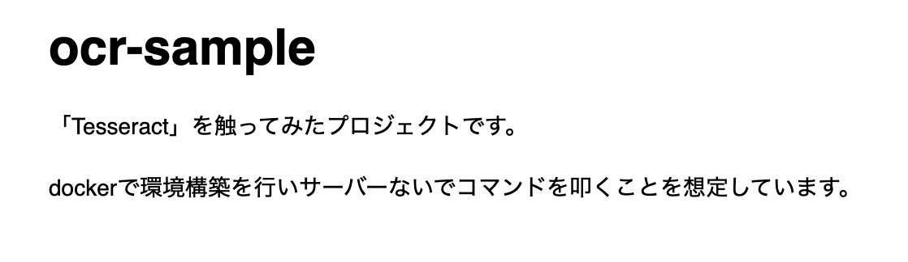

# ocr-sample

「Tesseract」を触ってみたプロジェクトです。

dockerで環境構築を行いサーバーないでコマンドを叩くことを想定しています。

## 検証方法

```
# docker-composeを起動します
docker-compose up

# docker-composeで立てたコンテナにアクセスします
docker-compose exec tesseract-server sh

# tesseractを実行して「sample.png」から日本語を抽出します
tesseract -l jpn sample.png result

# 抽出結果を表示します
cat result.txt
```

## サンプル実行結果


### サンプル画像



### 解析結果

```
ocr-sample

「Tesseract」 を 触っ て みた プロ ジェ クト で す 。

docker で 環境 構築 を 行い サー バー な いで コマ ンド を 叩く こと を 想定 し て いま す 。
```